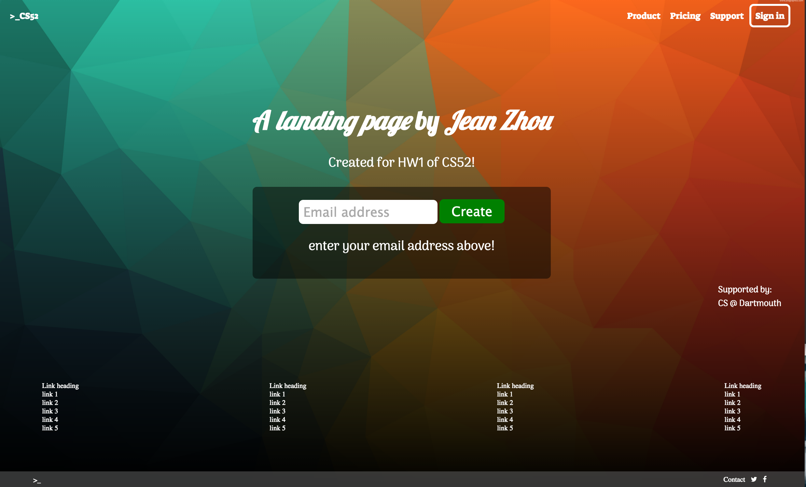
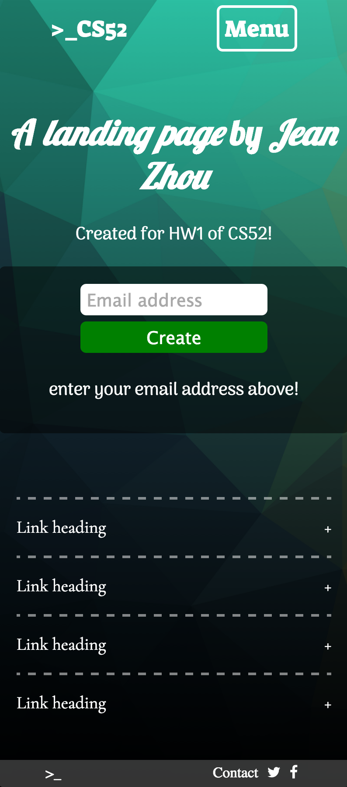

#LAB 1 of CS52
## by Jean Zhou

---
###General Comments

I used flex boxes to organize the entire layout of the page. Overall, I was able to get most components from the example to work. 

Here are the in-progress layout screenshots of my page. (Note: I didn't bother to change the text from the example until the final product). 

First layout:


Second layout:


And finally, this is the finished product of the page:



If I shrink the screen size on my laptop, the smaller version looks and works perfectly. It looks like this:



I even added the extra-credit CSS Checkbox Hack with transitions to expand the link headers and the menu, as well as an animation fade-in. Please try them yourself to see the transitions. Here are some example pictures:

Menu:


Links:


But the only thing I could not get to work perfectly was loading the page on my actual iPhone. There is no problem when I shrink the screen size on my laptop. But if I load the site on my iPhone, at first the media query didn't work at all.

I had to add the following media query code to get the smaller version to load on my iPhone:

```only screen and (min-device-width: 320px) and (max-device-width: 568px)```

 
Yet still, the layout is a bit off, and I'm at a loss as to what the discrepancy is. I am wondering if this is due to my iPhone version, 5S.

